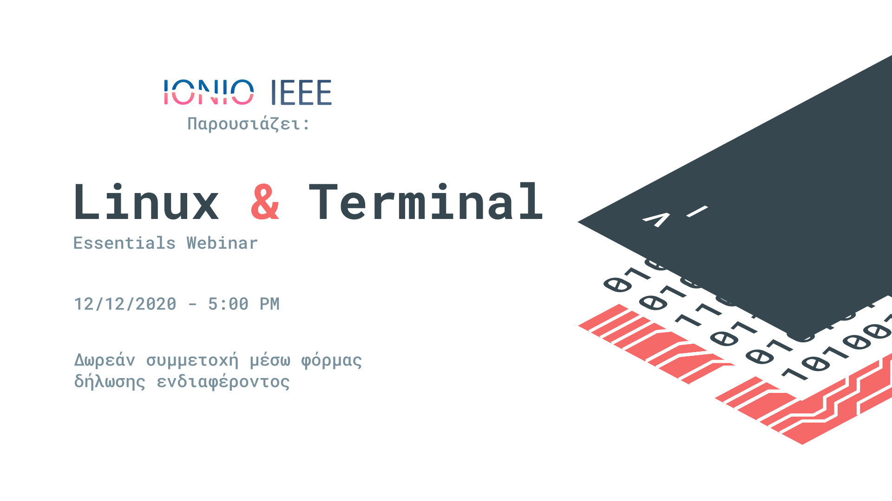

# Linux & Terminal Essentials Webinar

Αυτό το Repository περιέχει την παρουσίαση που έγινε στο "Linux & Terminal Essentials Webinar". Μπορείτε να δείτε την παρουσίαση [εδώ](https://link-later). 

## Χρήσιμα Links
#### Command Line
- [The Unix Shell](http://swcarpentry.github.io/shell-novice/)
- [You don't need GUI](https://github.com/you-dont-need/You-Dont-Need-GUI)
- [Awesome CLI Apps](https://github.com/agarrharr/awesome-cli-apps)

#### Community
- [Unix & Linux Stack Exchange](https://unix.stackexchange.com/)
- [Manjaro Linux Forum](https://forum.manjaro.org/)
- [AskUbuntu](https://askubuntu.com/)

#### Extras

- [Learn Vim](https://github.com/iggredible/Learn-Vim)
- [ArchWiki](https://wiki.archlinux.org/)
- [Window Managers](https://wiki.archlinux.org/index.php/window_manager)

## Βρείτε την Ionian IEEE

- [Facebook](https://www.facebook.com/ieeeIonianUni)
- [Instagram](https://www.instagram.com/iusbieee/)
- [Youtube](https://www.youtube.com/channel/UCrrleCKoTXqff_vbqy_kfjg)
